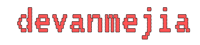

Hi there 👋 🧑‍💻 and welcome to my github account. My name is Artemi Lyakh. I am a backend developer from Krasnodar, Russia. In my repositories you can find a lot of interesting projects.

### What do I do?

- Languages:

    
    
    

- Back-end:

    
    
    
    
    

- Front-end:

    
    
    
    

- Databases:

    
    
    
    

- Others:

    
    
    

### Contact me!

- I am open for collaboration, so if you are interested in my work, feel free to contact me.

    
    
    

